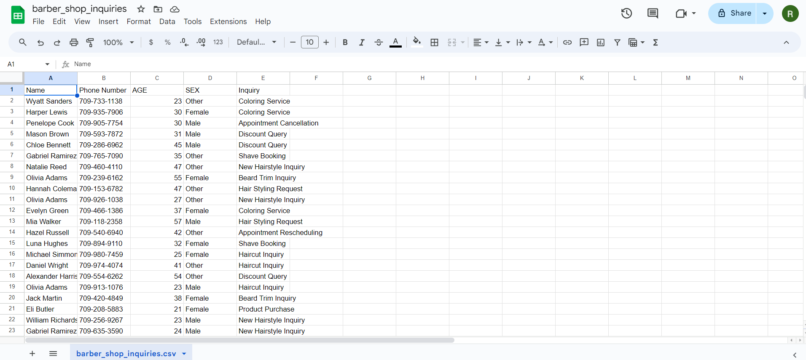

# BarberBot: A Real-Time Distributed Inquiry System for Barber Shops

## Problem Statement

Local barber shops struggle with managing customer inquiries, appointments, and personalized services as their business grows. Traditional methods become inefficient, leading to missed opportunities, difficulty in tracking customer preferences, and lack of data-driven insights for business growth.

## Approach and Methods

To address these challenges, we developed BarberBot, a distributed inquiry management system using the following approach:

1. **Distributed Architecture**: Implemented a network of interconnected nodes (barber shops) with a central coordinator.

2. **Real-Time Data Processing**: Utilized Apache Kafka for event-driven updates and real-time data streaming.

3. **Scalable Data Storage**: Employed Apache Cassandra for distributed data storage and replication.

4. **User-Friendly Interface**: Developed a Tkinter-based GUI for easy customer data entry.

5. **Advanced Analytics**: Implemented distributed data analysis for comprehensive customer trend analysis.

6. **Visualization**: Created a centralized Dash-based dashboard for real-time monitoring and data visualization.

## Solution

BarberBot offers a comprehensive solution with the following key features and tech stack:

1. **Automated Inquiry System**:
   - Built a Tkinter-based GUI for easy customer data entry
   - Captures key information: name, phone, age, gender, email, and inquiry
   - Utilizes OpenPyXL for automated Excel/CSV file handling and real-time updates

**GUI PREVIEW**

2. **Real-Time Synchronization**: 
   - Python backend for core logic and data processing
   - Apache Kafka for real-time data streaming across all locations

**CSV PREVIEW**

3. **Distributed Database**:
   - Apache Cassandra for scalable and fault-tolerant data storage

4. **Data Analysis and Visualization**:
   - Pandas for data manipulation and analysis
   - Dash and Plotly for creating an interactive dashboard with features such as:
     - Real-time inquiry tracking
     - Customer demographic visualization
     - Service popularity trends
     - Appointment scheduling overview
     - Revenue and performance metrics

**Dashboard PREVIEW**

5. **Personalized Marketing**:
   - Automated generation of targeted promotions and ad campaigns based on analyzed data

6. **Scalability and Fault Tolerance**:
   - Distributed architecture allowing easy integration of new barber shops
   - Load balancing and automatic redirection in case of node failures

## Impact

BarberBot was successfully sold to three local barber shops in St. John's, resulting in significant improvements:

- **30% increase in customer engagement** through personalized services and promotions
- **25% boost in sales** due to data-driven marketing strategies
- Enhanced customer experience with real-time access to preferences and history
- Improved resource utilization and reduced operational costs

As part of the implementation, we assisted the barber shops in launching targeted ad campaigns and promotions based on the insights gathered from the system. This personalized approach contributed significantly to the increase in customer engagement and sales.

By leveraging advanced distributed computing techniques and a robust tech stack, BarberBot has proven to be a game-changing solution for local barber shops looking to optimize their operations and drive growth.
