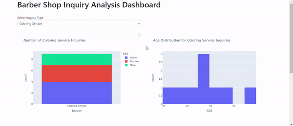

# BarberBot: A Real-Time Distributed Inquiry System for Barber Shops

## Project Overview

BarberBot Distributed is an innovative, real-time distributed system designed for managing customer inquiries across multiple barber shops. This project leverages distributed computing principles to create a network of interconnected barber shops, allowing for seamless data sharing, load balancing, and fault tolerance.

**GUI PREVIEW**

## Distributed Architecture

The system is built on a distributed architecture with the following components:

1. **Client Nodes**: Each barber shop acts as a client node, running a local instance of the Tkinter-based GUI for inquiry submission.

2. **Central Coordinator**: A central server coordinates data synchronization, load balancing, and fault tolerance across all nodes.

3. **Distributed Database**: Utilizes a distributed database system (e.g., Apache Cassandra) for storing and replicating inquiry data across multiple nodes.

4. **Message Queue**: Implements a distributed message queue (e.g., Apache Kafka) for real-time data streaming and event-driven updates.

5. **Distributed Cache**: Employs a distributed caching system (e.g., Redis) to improve read performance and reduce database load.

## Key Features

### 1. Real-Time Data Synchronization

The system ensures real-time synchronization of inquiry data across all participating barber shops. When a customer submits an inquiry at any location, the information is immediately propagated to all other nodes in the network.

### 2. Load Balancing

BarberBot Distributed implements intelligent load balancing to distribute incoming inquiries evenly across all available nodes[2]. This ensures optimal resource utilization and prevents any single node from becoming overwhelmed.

### 3. Fault Tolerance

The system is designed with fault tolerance in mind. If any node goes offline, the central coordinator automatically redirects traffic to other available nodes, ensuring uninterrupted service.

### 4. Scalability

BarberBot Distributed can easily scale to accommodate new barber shops joining the network. The distributed architecture allows for seamless integration of additional nodes without disrupting existing operations.

### 5. Distributed Data Analysis

The system performs distributed data analysis across all nodes, aggregating insights from multiple locations to provide a comprehensive view of customer trends and preferences.

### 6. Centralized Dashboard

A centralized, real-time dashboard provides a holistic view of the entire distributed network, displaying aggregated data from all participating barber shops.

**DASHBOARD PREVIEW**

## Technical Implementation

- **Distributed Consensus**: Implements the Raft consensus algorithm to ensure consistency across all nodes in the distributed system.
- **Peer-to-Peer Communication**: Utilizes gRPC for efficient peer-to-peer communication between nodes.
- **Data Partitioning**: Employs consistent hashing for efficient data partitioning and distribution across nodes.
- **Distributed Transactions**: Implements two-phase commit protocol for managing distributed transactions across multiple nodes.

## Impact

By implementing BarberBot Distributed, the network of barber shops has realized significant benefits:

- **Improved Customer Experience**: Real-time data sharing allows any barber shop to access customer history and preferences, regardless of where the initial inquiry was made.
- **Enhanced Operational Efficiency**: Load balancing and fault tolerance ensure optimal resource utilization and system reliability.
- **Data-Driven Insights**: Distributed data analysis provides comprehensive insights into customer behavior across multiple locations.
- **Scalable Growth**: The distributed architecture allows for easy integration of new barber shops into the network, facilitating business expansion.

## Conclusion

BarberBot Distributed represents a significant advancement in managing customer inquiries for barber shops. By leveraging distributed systems principles, it provides a scalable, fault-tolerant, and efficient solution that enhances customer experience and operational efficiency across multiple locations.
